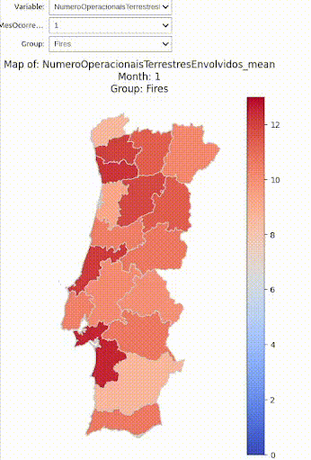

# DATATTACK-UP-23 -> Predicting Resources for Civil Protection Emergencies in Portugal
## Hackathon Winner 🏆

Developed by:

- Miguel Neves (neves.miguel8@gmail.com)
- Vasco Reid (vascoreid@gmail.com)
- Filipa Costa (filipabcosta@tecnico.ulisboa.pt)

This project aims to predict the quantity of resources needed for every Civil Protection emergency based on the location, the nature of the emergency, and time, in Portugal. The data used was retrieved from the publicly available data collected by The National Emergency and Civil Protection Authority in 2016. [Protecao Civil GitHub](https://github.com/centraldedados/protecao_civil)

## Data Exploration and Preparation

The dataset underwent pre-processing and preliminary analysis. GPT-4 was used to condense 88 different types of emergency into 10 categories. Records with fewer than 100 occurrences and missing values were eliminated. Aerial resources were not considered due to insufficient data. We also analyzed the temporal dependencies of the quantity of resources that needed to be allocated. The variable `DataOcorrencia` was divided into `Month`, `Day`, `Weekday`, and `Hour`.

## Data Visualization - Geoheatmap

We created a tool that displays geographic data on past incidents that required resources (workers and vehicles) per month and per incident category. This information helps in handling similar incidents in the future.

The amount of resources required is calculated based on the simultaneous resources needed on a particular day. The tool presents monthly requirements as an average of all days, or as the maximum or minimum requirements observed across all days (worst and best case scenarios, respectively).

The tool provides decision makers with an easy-to-understand visualization of past events. They can use this information to determine whether the allocation of resources was effective and make adjustments as needed.

For instance, in the video below, the tool displays the number of operatives required per month to manage fires in each region. The data reveals some patterns, such as higher resource needs during summer and a greater need for resources in southern and inland regions.

## Regression and Classification Models

We created regression and classification models to predict the number of people and vehicles needed to be allocated for every emergency, with an accuracy of 60% and 78%, respectively.

---

## Report

For more information check the [Report.md](docs/Report.pdf)

## Repository Contents

- `data/`: Folder containing the dataset from The National Emergency and Civil Protection Authority.
- `media/`: Folder containing images and presentation.
- `docs/`: Folder containing report.
- `models/`: Folder containing research on ML and DL models.
- `pre-process-data-vis/`: Folder containing pre-processing and data visualization files.
- `R-research/`: Folder containing R files that researched the dataset, pre-processed and trained some ML model.

## Dependencies

- Python 3.6 or higher
- pandas
- geopandas
- numpy
- scikit-learn
- matplotlib
- seaborn
- geopandas
- Notebook

## License

This project is licensed under the MIT License.
